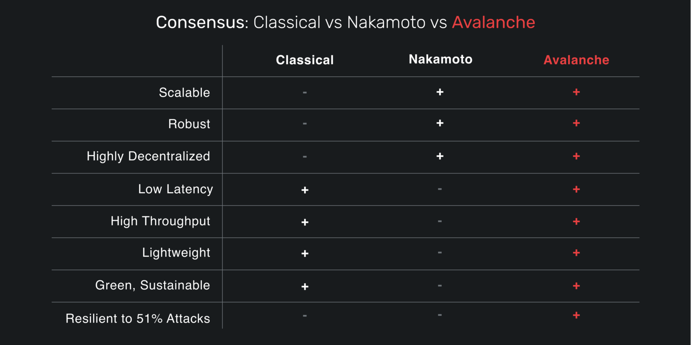

# 雪崩网络Avax概述

## 概述

Avalanche是一个开源平台，用于在一个可互操作、高度可扩展的生态系统中启动去中心化应用程序和企业区块链。Avalanche 是第一个为全球金融规模构建的去中心化智能合约平台，具有近乎即时的交易确定性。以太坊开发人员可以在 Avalanche 上快速构建，因为 Solidity 开箱即用。

Avalanche 与其他去中心化网络之间的一个关键区别是共识协议。过去，人们错误地认为区块链必须缓慢且不可扩展。Avalanche 协议采用一种新颖的共识方法来实现其强大的安全保证、快速的确定性和高吞吐量，而不会影响去中心化。

## AVAX 
AVAX 是 Avalanche 的原生代币。它是一种总量固定的稀缺资产，用于支付交易费用、通过质押保护平台安全，并在 Avalanche 上创建的多个子网之间提供基本的记账单位。  
`1 nAVAX = 0.000000001 AVAX`。

## 雪崩共识协议

Avalanche 系列中的协议通过重复的二次抽样投票来运行。当验证者确定交易应该被接受还是拒绝时，它会询问一小部分随机的验证者认为该交易应该被接受或拒绝。如果被查询的验证者认为交易无效，已经拒绝了交易，或者更喜欢有冲突的交易，它会回复认为交易应该被拒绝。否则，它会回复认为交易应该被接受。

如果有大部分a验证者抽样回复他们认为次交易应该被接受，那么验证者更倾向接受交易。后面查询该交易时，它也会回复它认为该交易应该被接受。类似地，如果足够多的验证者回答他们认为应该拒绝交易，验证者会更倾向于拒绝交易。

验证者重复这个采样过程，直到连续b轮，被查询的验证者中的大多数a以相同的结果（接受或​​拒绝）回复。

在交易没有冲突的常见情况下，最终确定会很快达成。当存在冲突时，诚实的验证者会迅速聚集在有冲突的交易周围，进入一个积极的反馈循环，直到所有正确的验证者都喜欢该交易。这会形成接受非冲突事务和拒绝冲突事务的结果。

雪崩共识的工作过程，它可以保证（基于系统参数的概率很高）如果任何诚实的验证者接受或拒绝交易，所有诚实的验证者都会接受或拒绝该交易。

通过阅读白皮书了解更多 Avalanche 共识协议的技术组件。

## Snowman共识
Snowman 是一种链优化的共识协议——高吞吐量、完全有序，非常适合智能合约。Snowman 由Avalanche 共识协议提供支持。P-Chain和C-Chain都实现了雪人共识协议。

## 主要特性

### 速度
使用由康奈尔计算机科学家团队开发的新型共识协议，能够在 1 秒内永久确认交易。
### 可扩展性
每秒可处理 4,500 笔交易——比现有区块链高出一个数量级。
### 安全
确保更强大的安全保障，远高于其他网络的 51% 标准。
### 灵活
轻松创建包含几乎任何任意逻辑的自定义区块链和去中心化应用程序。
### 环保
使用节能的权益证明共识算法而不是工作量证明。
### 智能合约
支持创建 Solidity 智能合约和您最喜欢的以太坊工具，如 Remix、Metamask、Truffle 等。
### 私有和公有链
创建您自己的公共或私有区块链。
### 为金融而生
原生支持使用复杂的自定义规则集轻松创建和交易数字智能资产。

