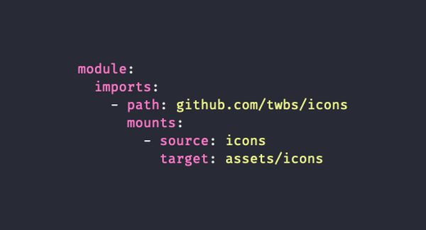

# Hugo module入门教程




Hugo 0.56.0 就引入了强大的 Module 系统。与其他包解决方案非常相似，它允许将任何 Hugo 项目定义为模块，无论是完整的网站、主题还是组件，都可以使用存储在某个存储库中的任何文件并将其作为自己的挂载。它还可以让任何 Hugo 项目成为一个完整的 Hugo 模块，拥有自己的配置和依赖项，任何其他项目都可以挂载。

在本文中，我们将了解 Hugo 项目如何使用存储在远程存储库中的文件，使用模块 imports 和 mounts 逻辑使它们成为自己的文件。

然后，我们将通过创建一个自己的模块来深入了解 Hugo 模块构成！

# 将项目作为模块初始化

在您可以导入一个存储库并使用其文件之前，您的项目需要作为一个 Hugo 模块初始化。

为此，您需要引用一个存储库。

我们假设你的 Hugo 项目已经有一个 GitHub 存储库，它位于https://github.com/me-me-me/my-repo

在项目根目录中执行

```bash
hugo mod init github.com/me-me-me/my-hugo-project
```

上面语句成功时，会生成一个go.mod在根目录。它应该如下所示：
```go
module github.com/me-me-me/my-hugo-project

go 1.14
```
它还将创建一个go.sum文件。一般我们不用关心这个文件。


# 导入远程存储库
对于这个基本的示例，我们将尝试合并 Bootstrap 团队通过在 [https://github.com/twbs/icons](https://github.com/twbs/icons)仓库中提供的图标。

config.yaml使用保留module键及其imports数组在您的项目中发生一切。
项目中关于模块发生的一切，都和config.yaml中的module字段下。
```yaml
module:
  imports:
    - path: github.com/twbs/icons
```

现在，如果您运行hugo，就会发现刚才go.mod文件刚刚换了一行。

```go
module github.com/me-me-me/my-hugo-project

go 1.14

require github.com/twbs/icons v1.0.0 // indirect
```
到这里，它并没有告诉 Hugo 如何处理这些文件。

在刚才的import字段下，使用mounts，它将为 Hugo 更多的指示。
```yaml
module:
  imports:
   - path: github.com/twbs/icons
     mounts:
     - source: icons
       target: assets/icons
```
mounts是一个数组，可以有多个，但现在我们只是添加了一个，配置说明如下

- source参数指向远程仓库中要挂载文件的位置。在这里，我们指向仓库根目录下的`icons` 的根目录。

- target参数指向在 Hugo 这个联合文件系统中应该挂载的位置。

配置好之后，我们将能够像访问项目中的任何其他文件一样访问图标 svg：
```html
{{ with resources.Get "icons/cart.svg" }}
  <div class="fill-current w-4">
    {{ .Content | safeHTML }}
  </div>
{{ end }}
```
这就是模块的作用


我们可以安全地显示这些 SVG图标，而无需将其复制到项目目录中。

如果某个图标需要定制，我们可以依靠 Hugo 的联合文件系统！

我们所要做的就是在我们的项目中创建一个同名图标文件，`assets/icons/cart.svg`以便使用它来代替 Bootstrap 自己的购物车图标。

**或者…**

我们甚至可以更疯狂地使用来自另一个远程仓库的图标，只为那个购物车图标......🤩
```yaml
- path: github.com/refactoringui/heroicons
    mounts:
    - source: src/solid/shopping-cart.svg
      target: assets/icons/cart.svg
- path: github.com/twbs/icons
	  mounts:
    - source: icons
      target: assets/icons
```
☝️ 此时，我们正在导入两个远程仓库，并具有各自的mounts设置的。

> 请注意，无论挂载的文件如何，Hugo 都必须下载整个存储库，因此在为其其中一个 svg 导入 5MB 存储库之前，您可能会三思而后行。

# 升级

如果仓库更新了怎么办？Hugo Module 的默认行为是，在第一次导入时，获取最新版本，或者如果没有找到版本，则在默认分支上获取最新的头。这就是为什么 Hugo记录 v1.0.0在 require 指令之后。

如果github.com/twbs/icons发布v1.1.0并且您想要该新版本，您可以：

`hugo mod get -u github.com/twbs/icons`
这将会用最新的版本来更新go.mod文件。

现在，如果您想要一个特定版本而不是最新版本，（我们将使用另一个 repo 作为该示例）：
```go
hugo mod get github.com/twbs/icons@v1.4.0
```
如果你想要一个特定的提交，你需要像这样@hash
```
hugo mod get github.com/twbs/icons@2396edfbfeda7a3f9c5d98f67e3540f593b28e1e
```

> 当然，您应该提交您的go.mod和go.sum文件，以便从事该项目的每个人都使用相同的版本！

# 创建一个 Hugo 模块
上面的内容很有趣，因为我们介绍了如何导入 repo 并将其文件作为我们项目的一部分。但真正的力量来自于使用完整的 Hugo 模块，因为它们可以单独展示template 文件, asset 文件, data 文件, 甚至 content 文件!

还有什么比创建我们自己的更好的方式来了解它们！

为了演示，我们将创建自己的图标模块。它将：

1. 从远程仓库导入一些 SVG 文件
2. 创建一个页面，列出网站上所有可用的图标。
3. 加载自己的icon 组件，这将简化项目上任何图标的打印。

首先，我们在本地机器上创建一个目录。我们会给它起一个简陋的名字：hugo-icons.

## 1. 导入
我们需要的第一件事是config.yaml为我们的模块注册其导入的文件。

是的，任何 Hugo 项目，无论是网站、主题还是组件，都可以导入其他模块或 repo。导入树是无限的。正如我们已经提到的，它是一个真正的依赖解决方案！

我们的导入和挂在配置将与我们之前所做的非常相似。我们只需将文件挂载到预留的目录中，以确保我们不会与其他模块发生文件冲突。

```yaml
# config.yaml
module:
  imports:
   - path: github.com/twbs/icons
     mounts:
	   - source: icons
	     target: assets/hugo-icons/icons

```
## 2.创建列表页面
为此，我们需要两件事。

1. 一个内容文件挂在到项目中
2. Hugo 的模板文件，用于将该内容文件渲染为页面。

由于这些mounts设置，这些文件不必遵循 Hugo 项目的通常目录结构。它们可以在任何地方，这在我们的组件化模块的上下文中是有意义的。

我们添加两个文件
```
page/layout.html
page/content.md
```
看下面更新之后的config.yaml，您会注意到我们正在处理的挂载设置位于module的根部。

那是因为挂载不依赖导入。您可以使用mounts关键字在配置项目的挂载。
```yaml
# config.yaml
module:
  mounts:
    - source: page/index.md
      target: content/hugo-icons-listing.md
      lang: en
    - source: page/template.html
      target: layouts/_default/hugo-icons-listing.html
  imports:
   [...]
```

> 语言!
请注意，该lang参数仅在多语言站点上很重要，甚至在那些站点上，省略它只会将页面放在默认语言站点下。


各个文件的内容

page/index.md

```markdown

---
title: Hugo Icons Archive
layout: hugo-icons-listing
---
```
page/template.html

```yaml
{{ define "main" }}
  {{ range resources.Match "hugo-icons/icons/*.svg" }}
    <div style="fill:currentColor;width:3rem;margin:1rem 0">
    {{ .Content | safeHTML }}
    </div>
  {{ end }}
{{ end }}
```

> 如果您的项目或主题baseof.html没有main块，将会出问题。
## 3.添加组件
icon组件可以放在partials/icons.html，我们可以注册一个新的挂载
```yaml
# config.yaml
module:
  mounts:
    [...]
    - source: partials
      target: layouts/partials/hugo-icons
  imports:
  [...]
```
请注意，我们会将其安装在预留的目录下，以便用户可以安全地调用{{ partial "hugo-icons/icon" "cart" }}. 这样我们就不会与另一个拥有自己icon的模块发生冲突。

我们非常基本的组件：
```
{{/*
  icon
  Will print the icon matching the string passed as "context"

  @author @yourstruly

  @context String (.)

  @access public

  @example - Go Template
    {{ partial "hugo-icons/icon" "cart" }}
*/}}
```

```
{{- with resources.Get (print "hugo-icons/icons/" .) -}}
  {{- .Content | safeHTML -}}
{{- end -}}
```
# 包装我们的模块
我们的模块现在提供了我们自己设定的三个功能。但是配置中缺少一件关键的事情。

我们使用 `resources.Match`的是在 Hugo 0.57.0 中引入的。并且， Hugo 0.64.0 才支持使用文件和子目录挂载。

所以 0.64.0 是我们的用户想要使用我们的模块时需要的最低版本，否则……失败！

```yaml
# config.yaml
module:
  hugoVersion:
    # We don't need extended (no sass)
    extended: false
    # We don't have a max version
    max: ''
    # We do have a min though.
    min: '0.64.0'
```

最终的config.yaml文件：

```yaml
module:
  hugoVersion:
    min: '0.64.0'
  mounts:
    - source: page/index.md
      target: content/hugo-icons-listing.md
      lang: en
    - source: page/template.html
      target: layouts/_default/hugo-icons-listing.html
    - source: partials
      target: layouts/partials/hugo-icons
  imports:
    - path: github.com/twbs/icons
      mounts:
      - source: icons
        target: assets/hugo-icons/icons
```


# 结论

Hugo Module 解决方案是将任何公共 repo 的文件导入您的 Hugo 项目并管理其版本控制的最佳方式。在看到构建一个是多么容易之后，它应该真正成为您管理可重用解决方案,并将它们分发到整个 Hugo 生态系统的首选方式。

在接下来的几周里，我们将在博客上写很多关于 我们构建的许多开源 Hugo 模块的原因和方法。但是你现在已经可以检视他们的代码，了解一些复杂、实用且通常注释良好的 Hugo 模块实现示例。

哦，这是我们在本文中构建的完整示例 repo 可 在[此处](https://github.com/regisphilibert/hugo-module-icons)获得。
