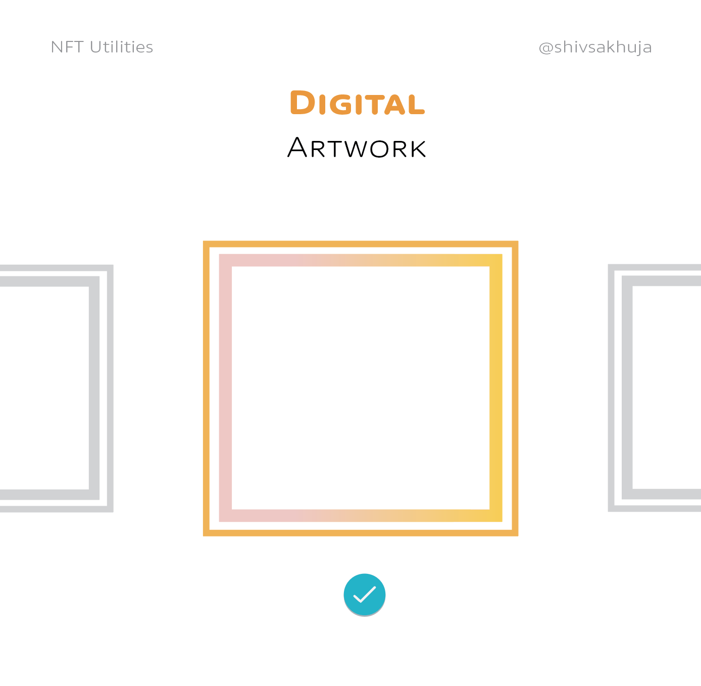

# NFT的真实使用场景探索

NFT 比你想象的更重要，这篇文章对正在构建的 NFT 的真实用例的可视化探索，以及它们未来的用途

# 炒作周期曲线

不知道大家知道Gartner提出的"炒作周期曲线"，它表明颠覆性技术的出现必然会

# NFT的应用场景
## 数字艺术
大多数人认为这就是 NFT 的全部——富人购买毫无价值的 JPEG 和 MP4 的投机泡沫

## NFT 资料图片
您可能还曾在 Twitter 上

看到过NFT 个人资料图片例如：我的个人资料图片是我使用@skogard的 factoria 应用程序铸造的 NFT，这有助于将我的帐户与假帐户区分开来。

图片

但这仅仅是开始。NFT 是一种表示所有权证明的方式。证明数字资产的所有权比证明实物资产更容易，这就是为什么艺术品和 pfps 是第一个用例。

但它们可以有更多用处。NFT 可用于表示任何唯一、拥有所有者并需要数字所有权证书的事物。

示例：域和用户名。

域和用户名
@unstoppableweb、@ensdomains和@rarible让你购买 NFT 域名。

图片

NFT 域的一大好处是它们是可转让的。Godaddy 和其他 web2 提供商上的域名不容易转让或出售。在许多情况下，您只是租用域而不是购买它们。

门票
同样，音乐会门票和其他活动通行证也非常适合用 NFT 表示。它们的数量是有限的，访问该事件需要证明。NFT 可以消除伪造问题，并且可以轻松验证真实性和所有权。

图片

🎫
NFT 门票也可以在二级市场上交易，这解锁了一些东西：1. 具有买卖双方保护的标准化市场（目前，门票在 FB 和 craigslist 等低效市场上交易） 2. 自由市场定价 3. 原创者的版税

图片

4.门票的历史所有权数据意味着表演者可以向粉丝空投未来的通行证、折扣、赠品等。5. NFT 通行证也可以作为展示你的粉丝的徽章。

在线票务市场估计价值 30B+ 美元......而且它正在快速增长。

🟡
我见过的一些基于 NFT 的票务项目： • @GetProtocol  
• @SeatlabNFT 
• @YellowHeartNFT 
• @GUTStickets 
• @WicketEvents

游戏资产
出于许多相同的原因，游戏内资产受益于 NFT。想象一下，有人花了 5 年的时间积累了一把稀有的游戏内收藏剑，然后长大或退出游戏。该收藏品显然对游戏玩家具有价值。

图片
今年游戏行业预计将获得 2000 亿美元的收入，其中很大一部分来自游戏内购买。这些游戏资产二级市场交易的特许权使用费为游戏公司创建基于 NFT 的生态系统提供了强大的动力。

但数字资产只是一个开始……现实世界的资产可以从链上 NFT 表示中获得很多相同的价值。

例如：房地产是独一无二的，有所有者，并且需要所有权证明。

房地产
🟢
代币化房地产有多重好处： 1. 可以细分以增加访问量和流动性
2. 可以抵押以提高资本效率和获得由链上资产支持的贷款 3. 允许投资者对特定社区、城镇或城市进行多样化或下注 +++

图片

我以前写过这个概念作为一个思想实验

希夫萨克
希夫萨克
@shivsakhuja _
这是一个🧵关于为什么房地产最终会被标记化以及该模型看起来像什么👇

的一个思想实验。

在推特上查看图片
405
晚上 8:00 - 2022 年 2 月 4 日
@0x_illuminati的团队也根据这个概念制作了一个视频。

加密光明会
加密光明会
@ 0x_illuminati
为什么房地产最终会被代币化以及该模型看起来像👇

动画解释器... 

[1/x]

在推特上查看图片
133
上午 7:06 - 2022 年 6 月 18 日
到目前为止，我们只讨论了 NFT 对可转让资产的好处。

但是不可转让的 NFT 呢？

这是人们现在称之为灵魂绑定令牌或 SBT 的概念。@VitalikButerin写了关于这个..

生命力网
生命力网
@维塔利克布特林
Soulbound
vitalik.eth.limo/general/2022/0...

4,722
上午 12:26 - 2022 年 1 月 27 日
就像我说的，NFT 本质上是任何人都可以验证的数字证书。

学位和文凭
这非常适合学位和文凭等用例。当然，您不希望这些是可交易的，因此可以将它们制成不可转让的 SBT。

图片

在链上拥有一个标准化的、公开的文凭、学位、技能和成就证明意味着任何人都可以验证他们的合法性。例如： • LinkedIn 可以为您的学位或技能提供经过验证的复选标记。所有其他类型的证书也是如此。

成就与技能
图片

防伪
这对于防伪也很有用。假冒是世界上最大的犯罪活动，估计每年价值 2 万亿美元，而且还在不断增长。因此，防伪技术具有很大的价值。

@ORIGYNTech正在为此努力。

图片

身份
说到伪造，身份盗用/验证是另一个可以使用 NFT 解决的巨大现实问题。在美国，每年有超过 1500 万公民面临身份盗用，每年遭受的损失超过 500 亿美元。

这一点都不奇怪，因为美国身份盗窃所需的只是一个 9 位数的号码，该号码经常在电子邮件、文件、电话等中传递。

🙋
Identity NFT 如何解决这个问题？• NFT 是独一无二的，不能伪造。• NFT 提供全球标准。• NFT 可以轻松验证。• 不可转让的 NFT (SBT) 被锁定到特定的钱包。• NFT 可以在钱包丢失或被盗的情况下被撤销。
图片

这可能是 NFT 最大的全球用例之一。

图片

而且由于您的身份不仅仅是您的政府 ID，您可能会有多个身份 NFT。

@0xPolygon和@civickey正在研究链上身份等。

图片
会员资格
数字和实体会员也可以使用 NFT 来验证访问要求。

图片

表决
NFT 身份还可以解决投票验证等问题。如果您还记得 2020 年美国大选，就无需解释为什么这是一个值得解决的问题。在线投票的简单性也可以提高投票率。

图片

NFT 还可用于保护知识产权。

cantino.eth
cantino.eth
@克里斯坎蒂诺
内容提交

用户将提交短视频、评论和教程等内容以换取 NFT。这是一个营销飞轮。

可以将权利编程到合同中，以便在广告中使用贡献者的内容可以为他们带来未来的利润。

203
凌晨 3:44 - 2022 年 2 月 4 日

知识产权
图片
这可以让创作者从他们的创作中获得版税。 

⚙️
NFT 有 2 个关键属性： • 可验证性 → IP 所有权明确定义且可公开验证。• 标准化→ 为允许创作者从其IP 中赚取版税的平台打开大门。
内容权利
图片

没有版权的货币化 = 每个人都有更多机会。

cdixon.eth
cdixon.eth
@cdixon _
NFT 完全独立于版权。

你可以为 NFT 选择任何你想要的版权。

一个流行的（我认为最好的选择）是 CC0=公共域。

让创作者在消除版权的同时获利与施加稀缺性相反——它增加了共享/丰富度。

696
凌晨 4:52 - 2021 年 12 月 12 日

音乐是一个非常明显的用例。

图片
https://twitter.com/cdixon/status/1469772213779849226

创作者目前被搞砸了，从 Spotify 和 Apple Music 等平台赚取的收入很少。

希夫萨克
希夫萨克
@shivsakhuja _
每个创作者的平均收入：

- Spotify（每位艺术家 636 美元）

- YouTube（每个频道 405 美元）

- FB（每位用户 0.10 美元）

- NFT（每位创作者 174,000 美元）@ PastryEth 提供

的信息（见下面的推文）twitter.com/PastryEth/stat。 ..

在推特上查看图片

糕点
糕点
@PastryEth _
创作者收入（2021 年）

Spotify：
-7B美元给创作者 -1100 万艺术家
-636
美元平均/艺术家

Youtube： -15B
美元给创作者
-3700 万频道 -405
美元平均/艺术家

元： -3
亿美元给创作者
-3B 用户
-$0.1 平均/用户

NFT：
-$3.9B 给创作者
-22.4k 创作者
-$174k Avg/Artist

仍然低估 Web3？

2,307
凌晨 4:01 - 2022 年 6 月 6 日
53
晚上 10:06 - 2022 年 6 月 6 日

众筹
创作者也可以使用 NFT 进行众筹。例如，投资者可以获得代表未来特许权使用费权利的 NFT。这对于那些不在前 1% 的人无法赚钱的领域特别有用。（例如：职业运动员）

图片

金融 NFT
这导致了更广泛的金融 NFT (fNFT) 概念。有许多独特的金融合同。

💰
例子：
个人的一揽子资产（独特的投资组合）
与已部分偿还的贷方签订的债务协议
时间锁定代币（例如：veCRV）
图片

法律合同
通常，任何法律合同或文件都可以从 NFT 代表中受益。

cantino.eth
cantino.eth
@克里斯坎蒂诺
法律

区块安全的好处及其通过预言机触发交易的能力将加速采用 web3 法律服务 + 合同开发。

DocuSign 杀手（或收购目标）将于 2022 年建成，并将 NFT 交付给合同执行者。

245
凌晨 3:44 - 2022 年 2 月 4 日
图片

电子邮件和消息
包括通过电子邮件和消息达成的口头协议。

图片
病历
🏥
病历也是：
疫苗接种证书
新冠病毒检测结果
处方
图片

现有的纸质/PDF 证明系统存在 Photoshop 风险。

我试图涵盖我能想到的大多数用例，但我认为这几乎没有触及表面。人们也在寻找 NFT 的其他创造性用例。示例：@ShaanVP铸造了一个名为“5 Minutes of Fame”的 NFT 👇

陕普里
陕普里
@ShaanVP _
NFT 赋予持有者在 My First Million 播客中播放 5 分钟的权利（每月下载约 100 万次）

如果我们卖给赞助商，那么“播放时间”将值几千。我以 0.25 ETH 开始拍卖

时间是你的。你可以随心所欲地使用它。

321
上午 12:01 - 2021 年 9 月 15 日

您可以阅读以下 2 个出色的主题，以了解有关 NFT 未来的更多信息： 1. @chriscantino https 的这块黄金：

cantino.eth
cantino.eth
@克里斯坎蒂诺
1/ NFT 的未来。🧵

5,778
凌晨 3:44 - 2022 年 2 月 4 日
2. @RealVision上@punk6529和@RaoulGMI之间的对话“ @ punk6529 

的世界”

希夫萨克
希夫萨克
@shivsakhuja _
与@RaoulGMI和@ punk6529在@RealVision上的“朋克6529 的世界”我做了一些笔记并将它们放入（第1/2 部分）[1/x]

🧵 👇 

在推特上查看图片
300
凌晨 2:58 - 2022 年 4 月 11 日
